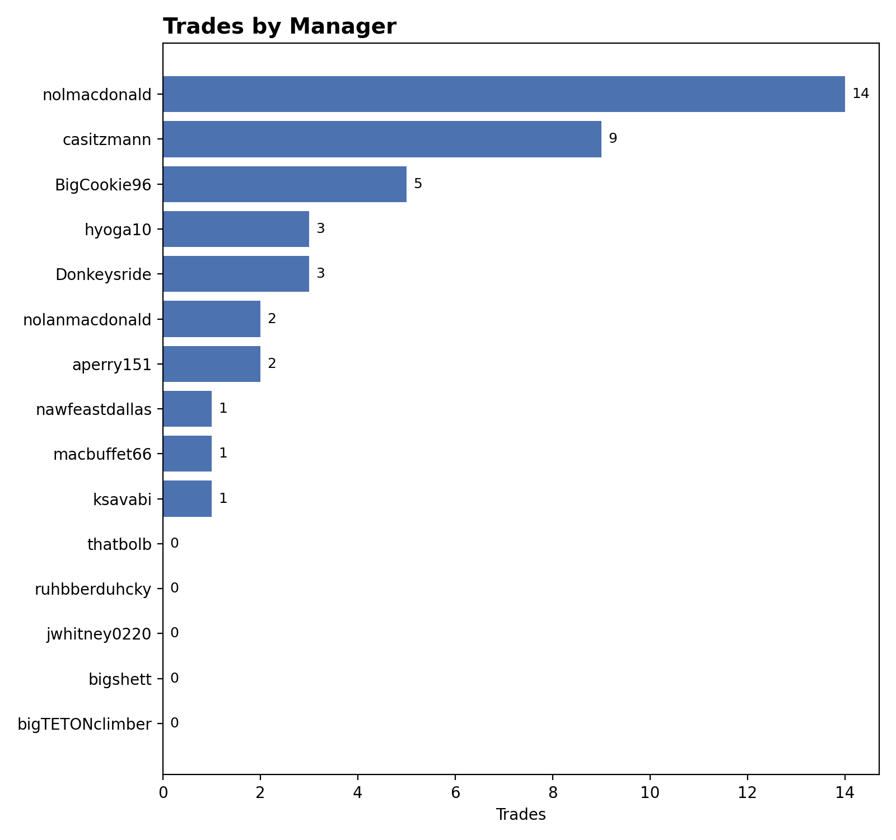
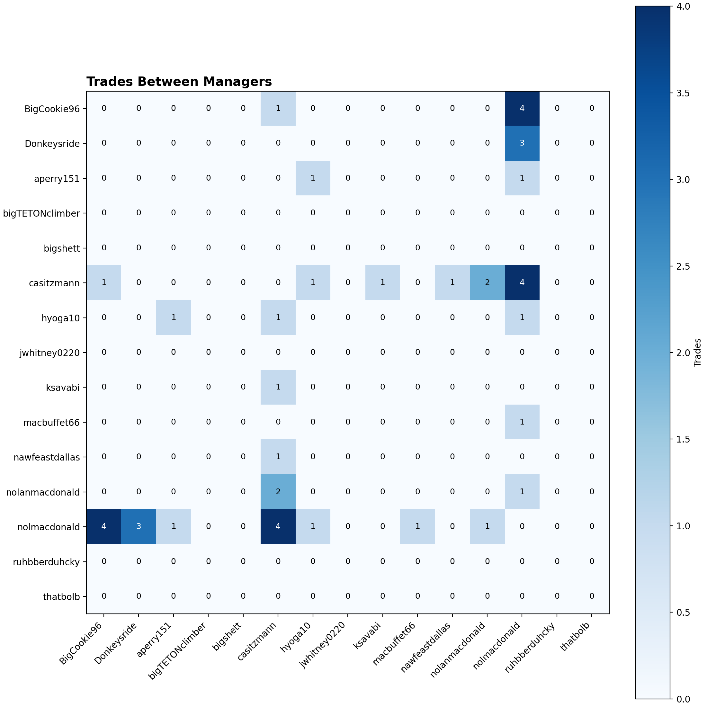
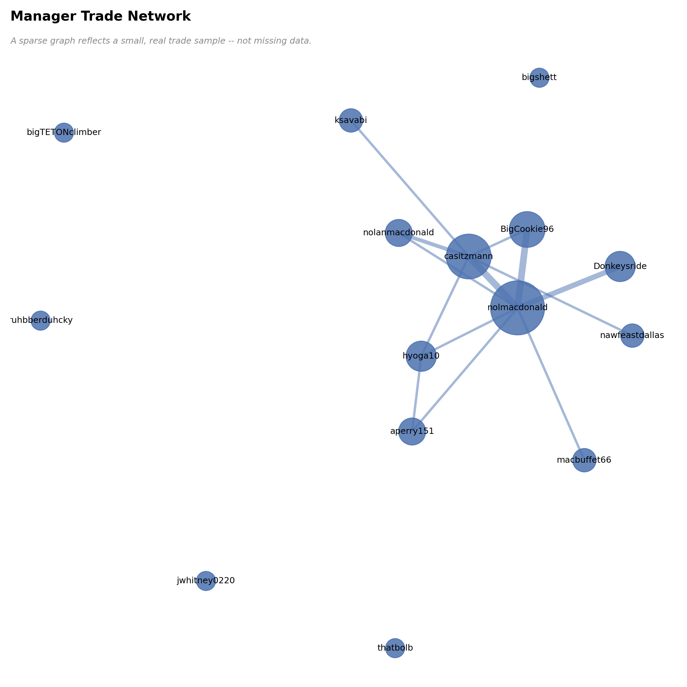
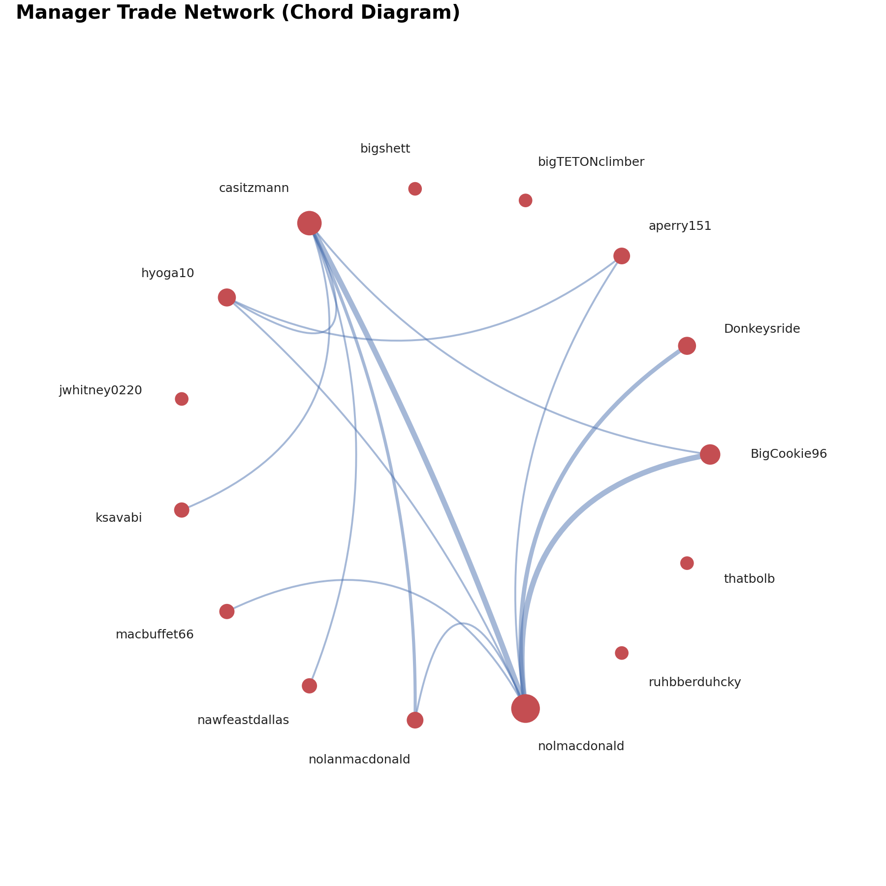
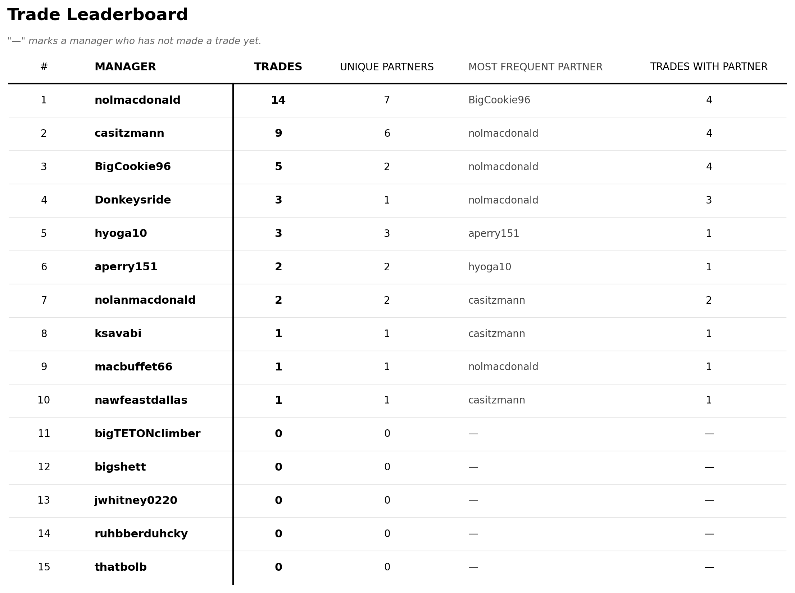
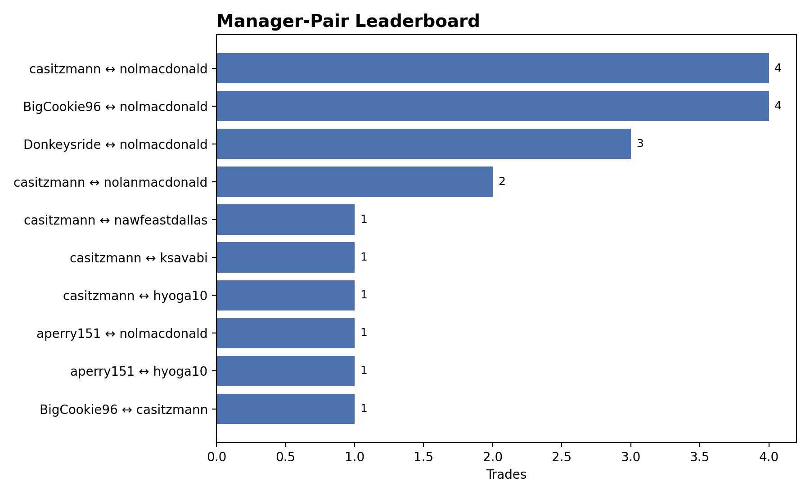
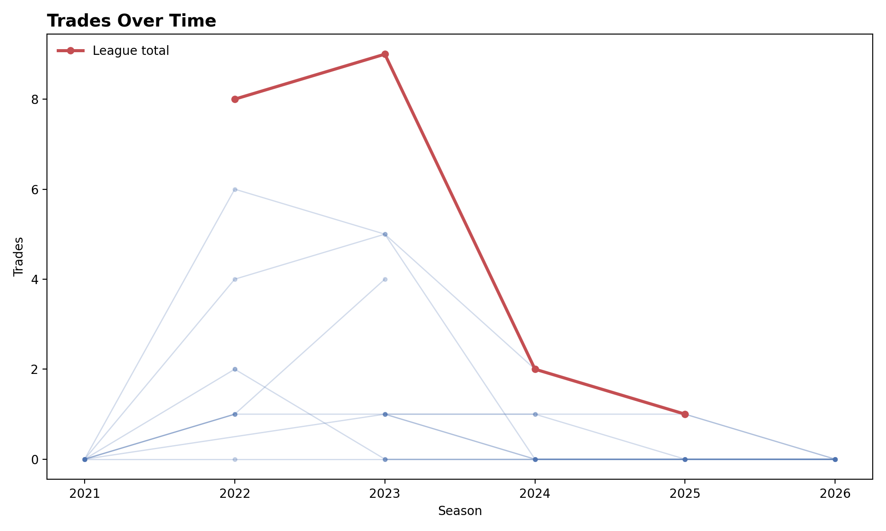
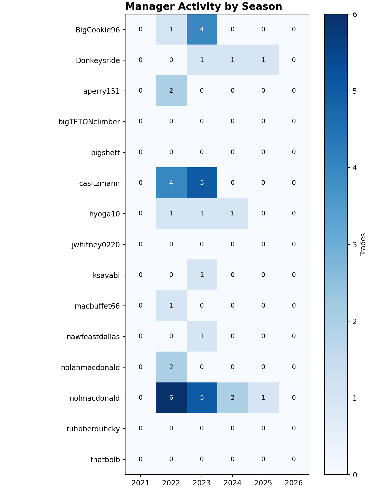
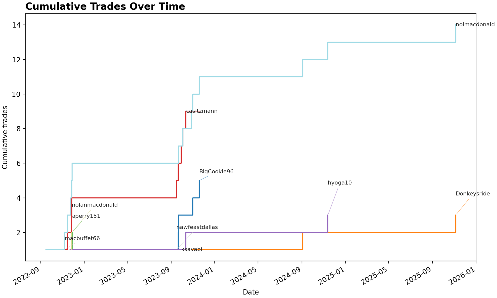
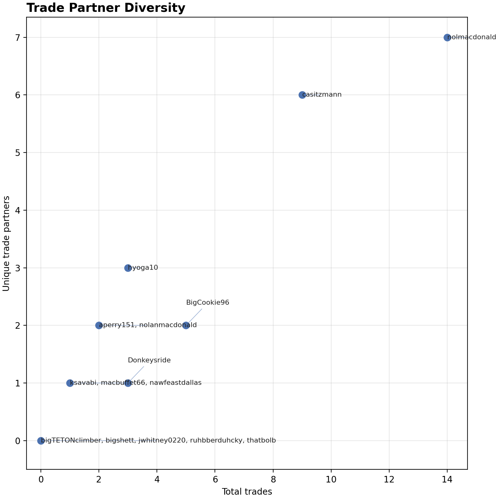

.. _league_trade_history:

League Trade History
=======================

``report trades`` turns a league's stored trade history into ten PNGs — who
trades, who trades with whom, and how that's changed over time. This page
walks through all ten, grounded in one real league's real data
(``1367225133634191360``, ``NUCLEARFF REDRAFT``): 22 completed trades since
2021, across the 15 managers who have ever held a roster in the league.
Your own league's numbers will differ; the shape of the output won't.

This is the same ``sleeper_transactions`` table ``sleeper fetch-league
--transactions`` writes — see :doc:`user_guide`'s "Transaction history"
section if you haven't fetched it yet. No new fetching happens here; this
command only reads and renders what's already stored.

By default (``--all-users`` not passed) this command only includes managers
currently rostered in ``league_id``'s own season — 10 of this league's real
15 all-time managers. Since this page is specifically a full historical
walkthrough, every example below passes ``--all-users`` to include all 15;
drop the flag for a leaner, current-roster-only view instead. See
:doc:`user_guide`'s "Trade network analysis" section for the flag's default
behavior and why it exists.

Running the command
-----------------------

.. code-block:: text

   $ nuclearff --root ./demo report trades 1367225133634191360 --all-users
   Managers:                 15
   Trades by manager:        ./demo/data/artifacts/1367225133634191360-trades/trades_by_manager.png
   Trades heatmap:           ./demo/data/artifacts/1367225133634191360-trades/trades_heatmap.png
   Trade network:            ./demo/data/artifacts/1367225133634191360-trades/trade_network.png
   Trade leaderboard:        ./demo/data/artifacts/1367225133634191360-trades/trade_leaderboard.png
   Manager-pair leaderboard: ./demo/data/artifacts/1367225133634191360-trades/manager_pair_leaderboard.png
   Manager x season heatmap: ./demo/data/artifacts/1367225133634191360-trades/manager_season_heatmap.png
   Trades over time:         ./demo/data/artifacts/1367225133634191360-trades/trades_over_time.png
   Cumulative trades:        ./demo/data/artifacts/1367225133634191360-trades/cumulative_trades.png
   Trade-partner diversity:  ./demo/data/artifacts/1367225133634191360-trades/trade_partner_diversity.png
   Chord diagram:            ./demo/data/artifacts/1367225133634191360-trades/chord_diagram.png

``nolmacdonald`` (14 trades) is this league's most active trader by a wide
margin; five managers have never made one. ``--out-dir`` overrides the
default output location, ``<artifacts>/<league_id>-trades/``.

Trades by manager
---------------------

A horizontal bar chart, one bar per manager, sorted highest first. A
manager's bar counts **distinct trades, not trade relationships** — Sleeper
allows more than two rosters in a single trade, and this league has a real
one: a 2022 three-team trade among ``casitzmann``, ``nolmacdonald``, and
``nolanmacdonald``. Each of those three managers' bars counts it once, not
twice, even though it touches two other managers each.

A manager needs a resolvable Sleeper display name to appear at all. Two of
this league's 22 real trades have a roster whose owner isn't in that
season's user list — a real (if rare) Sleeper data inconsistency, not a bug
here — so neither trade contributes to any manager's count.

``sleeper_standings`` (written by ``--standings``) supplies the *full*
manager roster, so a manager with zero trades still shows up at ``0``
instead of being silently missing. Skip ``--standings`` and the chart still
renders — it just can't include a manager who never traded, since trade
data alone gives no way to know they exist.

   Real output for ``nolmacdonald``'s league (``1367225133634191360``).

Trades between managers
---------------------------

A manager x manager heatmap, symmetric by construction — trades between
``casitzmann`` and ``nolmacdonald`` show as ``4`` in both directions — with
a ``0`` diagonal, since a manager can't trade with themselves. The
three-team trade mentioned above lands as one ``+1`` for each of the three
pairs it touches (``casitzmann``-``nolmacdonald``,
``casitzmann``-``nolanmacdonald``, ``nolmacdonald``-``nolanmacdonald``), not
counted twice for any single pair. Same full-roster densification as the
bar chart: a manager with zero trades still gets a dense, all-zero row and
column rather than being omitted from the grid.

   Real output for ``nolmacdonald``'s league.

Manager trade network
-------------------------

A node-link graph: one node per manager (sized by their total trades), one
edge per manager pair that has traded (widened by the trade count between
that pair) — the same densified, full-roster inputs as the bar chart and
heatmap, so a zero-trade manager still appears, here as an isolated node
rather than being silently dropped. With only 22 trades across 15 managers,
the graph is genuinely sparse — this league's real graph has 13 edges
across 15 nodes, and several managers never connect to the rest of the
league at all. That's this league's real trading activity, not a rendering
bug, and the chart says so directly.

   Real output for ``nolmacdonald``'s league.

Chord diagram
-----------------

A more presentation-oriented view of the same relationships as the network
graph above: managers sit evenly spaced on a circle, and each pair with at
least one trade is joined by a curved arc, widened by trade count. Node
size still tracks total trades, so ``nolmacdonald`` (the league's most
active trader) is both the largest node and the center of the widest arcs.

This is drawn directly in matplotlib rather than through an interactive
plotting library — every other visualization on this page is a static PNG,
and keeping this one the same avoids adding a headless-browser dependency
for a single chart. With a small trade sample like this league's real 22,
expect a visibly sparse diagram; that's a real result about this league,
not a bug.

   Real output for ``nolmacdonald``'s league.

Trade leaderboard table
---------------------------

One reference row per manager — Trades, Unique Partners, Most Frequent
Partner, Trades With Partner — sorted by trade count, most active first. It
has no circle-cropped headshots unlike ``nuclearff``'s player tables — a
manager avatar is resolvable (see :doc:`user_guide`'s "League avatar
table" and "Cumulative wins" sections), this table specifically just
stays a plain reference table instead. A zero-trade manager still gets a
full row rather than being omitted, with ``—`` in place of a partner that
doesn't exist.

   Real output for ``nolmacdonald``'s league.

Manager-pair leaderboard
----------------------------

A horizontal bar chart of the top 10 manager pairs by trade count, labeled
``Manager A ↔ Manager B``. Unlike the heatmap (dense over every manager,
including zero-trade pairs) it only shows pairs that actually traded — with
a real 22-trade history, that's 10 pairs across 15 managers, most tied at a
single trade. Each pair appears once: Sleeper trade rows are exploded into
manager-pair edges with the two names already sorted alphabetically, so
grouping directly on them can never produce both an A↔B and a B↔A row for
the same pair.

   Real output for ``nolmacdonald``'s league.

Trades over time
--------------------

One thin line per manager plus a bold league-wide total line, by season. A
manager's line covers only the seasons ``sleeper_standings`` shows them
actually rostering — joining a league partway through starts their line
there rather than drawing it back through seasons before they existed, and
a season they rostered but didn't trade in renders as a real dip to ``0``
rather than a gap. The league total counts each trade once regardless of
how many managers it involved, the same de-duplication every other
trade-count aggregate on this page uses — summing every manager's own line
instead would roughly double-count a season's real trade volume, since most
trades involve two managers.

   Real output for ``nolmacdonald``'s league.

Manager x season heatmap
----------------------------

The same manager x season data as the line chart above, as a grid instead:
rows are managers, columns are seasons, each cell is that manager's trade
count for that season, annotated with the raw number. Unlike the line
chart, every cell is dense — a season before or after a manager was in the
league renders as the same explicit ``0`` as a season they rostered but
didn't trade in, since a heatmap has no "connect the dots" failure mode
that a gap would otherwise avoid. This league's real 2022 peak —
``nolmacdonald``'s 6 trades in a single season — renders as the single
darkest cell on the grid.

   Real output for ``nolmacdonald``'s league.

Cumulative trade history
----------------------------

A step chart (not a straight-line one, so a manager's count doesn't appear
to accrue gradually between real trade events) of each manager's running
trade total over time, answering "who became the league's most prolific
trader, and when did they take the lead." Lines are labeled directly at
their end rather than in a legend, since a legend for 15 real managers
would either overflow the figure or need its own overlap fix. This league's
real history: ``nolmacdonald`` is the all-time leader with 14 of the
league's 22 trades, visibly taking the lead in late 2023.

   Real output for ``nolmacdonald``'s league.

Trade partner diversity
----------------------------

A scatter plot — X axis is total trades, Y axis is unique trade
partners — separating a manager who trades widely from one who repeatedly
trades with the same one or two people, a distinction the raw trade count
alone can't make. A manager with zero trades still plots, at the origin,
rather than being dropped; this league's real 5 zero-trade managers
(``bigTETONclimber``, ``bigshett``, ``jwhitney0220``, ``ruhbberduhcky``,
``thatbolb``) collapse into a single labeled point there rather than five
fully-overlapping ones. ``nolmacdonald`` (14 trades, 7 partners) and
``casitzmann`` (9 trades, 6 partners) stand out as the widest traders, while
``ksavabi``, ``macbuffet66``, and ``nawfeastdallas`` (1 trade, 1 partner
each) visibly contrast with ``hyoga10`` (3 trades, 3 partners) — the same
raw trade count band, opposite diversity.

   Real output for ``nolmacdonald``'s league.

Reading these charts correctly
-----------------------------------

Three real details from this exact data apply across every chart on this
page, not just one:

- **A manager needs a resolvable Sleeper display name to appear at all.**
  Two of this league's 22 real trades have a roster whose owner isn't in
  that season's user list, so neither trade contributes to any chart.
- **Sleeper allows more than two rosters in a single trade.** Every
  trade-counting aggregate on this page de-duplicates by the underlying
  transaction, not by exploded pairwise edges — a 3-team trade contributes
  one trade to each of the three managers involved, not two.
- **Manager identity is a display name, not a stable id**, and this
  league's data shows exactly why that matters: ``nolmacdonald`` (14
  trades) and ``nolanmacdonald`` (2 trades, including the three-team trade
  above) render as two separate managers throughout every chart on this
  page. Nothing here merges similar-looking names automatically — reading
  these charts correctly means knowing your own league's naming history.

See Also
----------

- :doc:`user_guide` — every other ``nuclearff`` CLI command, including
  ``sleeper fetch-league --transactions``, the data this page's command
  reads.
- :doc:`sleeper_api_tutorial` — the Sleeper API itself, independent of the
  CLI.
- :doc:`api/index` — full reference for
  :mod:`nuclearff.sleeper.trades` and :mod:`nuclearff.report.trades`.
