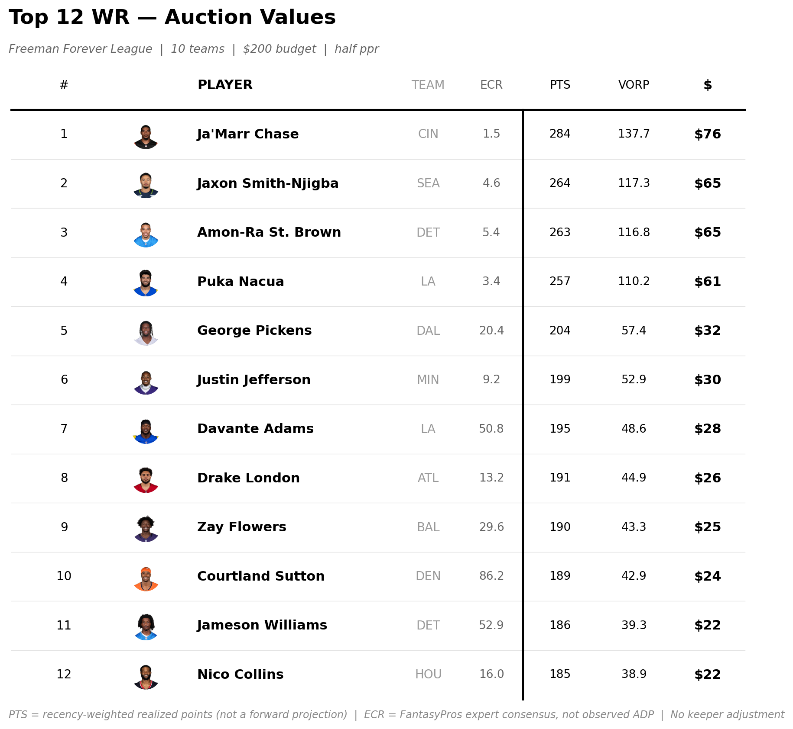

.. _tutorial_auction_draft_board:

9. Building an Auction Draft Board
=========================================

:doc:`08_valuation` covered VORP and tiers as standalone pieces. This
chapter wires everything from Chapters 5 through 8 into one pipeline:
Sleeper league settings → real fantasy points → a value estimate →
replacement level and VORP → auction dollars → a full report. This is the
:mod:`nuclearff.pipeline.auction_board` module, and it's exactly what
produces the auction board CSV, markdown report, and PNG tables.

.. note::

   ``NUCLEARFF REDRAFT``, this tutorial's running example everywhere else,
   runs a snake draft — no auction budget to price against. This chapter
   uses a different real league on the same Sleeper account,
   ``Freeman Forever League`` (``1387966835797798912``), whose draft
   actually is an auction.

The wiring, step by step
------------------------------

:func:`~nuclearff.pipeline.auction_board.build_auction_board` runs the
whole pipeline in one call, but every step it wires together already
exists on its own — nothing here reimplements scoring, projection,
replacement level, or the dollar conversion:

.. code-block:: python

   from nuclearff.sleeper import SleeperClient
   from nuclearff.pipeline import build_auction_board

   league_id = "1387966835797798912"
   client = SleeperClient(cache_dir="./demo/data/cache")

   board, context = build_auction_board(
       league_id, seasons=[2024, 2025], as_of_season=2026, client=client, baseline="vols",
   )

   print(context["league_name"], context["season"])
   print(f"Budget: ${context['budget_per_team']}/team x {context['num_teams']} teams")
   print("Players valued:", board.height)
   print("In draft pool:", board.filter(board["in_draft_pool"]).height)

.. code-block:: text

   Freeman Forever League 2026
   Budget: $200/team x 10 teams
   Players valued: 746
   In draft pool: 140

Internally, ``build_auction_board`` did exactly this:

1. **League settings and budget** — :func:`~nuclearff.config.league.league_config_from_sleeper`
   for scoring/roster shape, :func:`~nuclearff.valuation.auction.budget_from_draft`
   for the per-team dollar amount, read straight from the Sleeper draft
   object.
2. **Realized points** — :func:`~nuclearff.pipeline.auction_board.score_seasons`,
   the same :class:`~nuclearff.scoring.engine.ScoringEngine` call from
   :doc:`05_scoring_engine`, across every season in ``seasons``.
3. **A value estimate** — :func:`~nuclearff.pipeline.auction_board.project_points`,
   a recency-weighted average of those realized seasons (:doc:`07_projections`'s
   idea, applied to whole-season point totals).
4. **Replacement level and VORP, per position** —
   :func:`~nuclearff.pipeline.auction_board.add_vorp_all_positions`, one
   call per position instead of four (:doc:`08_valuation`).
5. **Auction dollars** — :func:`~nuclearff.valuation.auction.auction_values`
   (below).
6. **A market comparison** — FantasyPros consensus rankings, joined by
   ``gsis_id``.

.. important::

   ``value_estimate`` is a **recency-weighted average of what players
   actually did**, not a forward projection. It carries no injury news, no
   depth-chart change, and a rookie with no prior season doesn't appear on
   the board at all — the same caveat :doc:`07_projections` states for
   ``blend_projection``, because this is the exact same idea applied to
   realized points instead of one rate column.

Auction dollars
--------------------

:func:`~nuclearff.valuation.auction.auction_values` is the dollar
conversion on its own — it distributes the league's spendable budget
across the draftable pool in proportion to each player's share of total
positive VORP:

.. code-block:: python

   top = board.sort("auction_value", descending=True).select(
       ["player_display_name", "position", "auction_value", "vorp", "rank_overall"]
   )
   print(top.head(6))

.. code-block:: text

   shape: (6, 5)
   ┌───────────────────────┬──────────┬───────────────┬────────────┬──────────────┐
   │ player_display_name   ┆ position ┆ auction_value ┆ vorp       ┆ rank_overall │
   ╞═══════════════════════╪══════════╪═══════════════╪════════════╪══════════════╡
   │ Jahmyr Gibbs           ┆ RB       ┆ 94.64         ┆ 171.56     ┆ 1            │
   │ Bijan Robinson         ┆ RB       ┆ 90.37         ┆ 163.74     ┆ 2            │
   │ Jonathan Taylor        ┆ RB       ┆ 77.64         ┆ 140.43     ┆ 3            │
   │ Ja'Marr Chase          ┆ WR       ┆ 76.16         ┆ 137.70     ┆ 4            │
   │ Derrick Henry          ┆ RB       ┆ 73.35         ┆ 132.56     ┆ 5            │
   │ De'Von Achane          ┆ RB       ┆ 65.75         ┆ 118.63     ┆ 6            │
   └───────────────────────┴──────────┴───────────────┴────────────┴──────────────┘

Keeper cost adjustment
----------------------------

Keeper inflation is implemented but not wired into ``build_auction_board``
— Sleeper exposes no keeper-price endpoint, so keeper costs must come from
you. Given a ``{player_id: cost}`` mapping,
:func:`~nuclearff.valuation.auction.keeper_inflation_multiplier` returns
the factor every non-kept dollar of value inflates by, and
:func:`~nuclearff.valuation.auction.keeper_adjusted_values` applies it:

.. code-block:: python

   from nuclearff.valuation.auction import keeper_inflation_multiplier, keeper_adjusted_values

   top3_ids = board.sort("auction_value", descending=True).head(3)["player_id"].to_list()
   keeper_costs = {player_id: 5.0 for player_id in top3_ids}

   multiplier = keeper_inflation_multiplier(board, keeper_costs, teams=10, budget_per_team=200)
   print(f"Inflation multiplier: {multiplier:.3f}")

   adjusted = keeper_adjusted_values(board, keeper_costs, teams=10, budget_per_team=200)
   print(
       adjusted.sort("auction_value", descending=True)
       .select(["player_display_name", "auction_value", "auction_value_keeper_adjusted"])
       .head(4)
   )

.. code-block:: text

   Inflation multiplier: 1.143
   shape: (4, 3)
   ┌───────────────────────┬───────────────┬────────────────────────────────┐
   │ player_display_name   ┆ auction_value ┆ auction_value_keeper_adjusted  │
   ╞═══════════════════════╪═══════════════╪════════════════════════════════╡
   │ Jahmyr Gibbs           ┆ 94.64         ┆ 5.0                            │
   │ Bijan Robinson         ┆ 90.37         ┆ 5.0                            │
   │ Jonathan Taylor        ┆ 77.64         ┆ 5.0                            │
   │ Ja'Marr Chase          ┆ 76.16         ┆ 87.01                          │
   └───────────────────────┴───────────────┴────────────────────────────────┘

Kept players (illustrated here with a made-up $5 keeper cost for the top
3) show their real kept cost, not their market value; every *other*
player's value inflates by the real 1.143x multiplier — the $585 of
market value those three keepers would otherwise have consumed still has
to be spent by the other nine teams, on everyone else.

Writing the full report
-----------------------------

:func:`~nuclearff.report.build.write_report` writes the CSV, one styled PNG
table per position, and a markdown report with a methodology section —
everything ``report auction-board`` writes on the command line
(:doc:`18_cli_reference`), called directly:

.. code-block:: python

   from nuclearff.report import write_report

   report_path = write_report(board, context, "./demo/data/artifacts", top_n=12)
   print(report_path)

.. code-block:: text

   demo/data/artifacts/report.md

   Real WR table for ``Freeman Forever League`` — one of four position
   tables this call renders (QB, RB, WR, TE). Pass ``render_tables=False``
   to skip these and avoid the ``plottable``/``matplotlib`` dev extra.

The markdown report's methodology section states the same caveats as
above in plain language — including, verified on this real league, that
its 2026 auction is genuinely its first, since every prior season was a
snake draft.

What's Next
-----------

An auction board values every player at once. :doc:`10_draft_and_playoff_visuals`
covers the complementary picture — what actually happened in a specific
draft or a specific season's playoffs, rendered as a grid or a bracket
tree.
