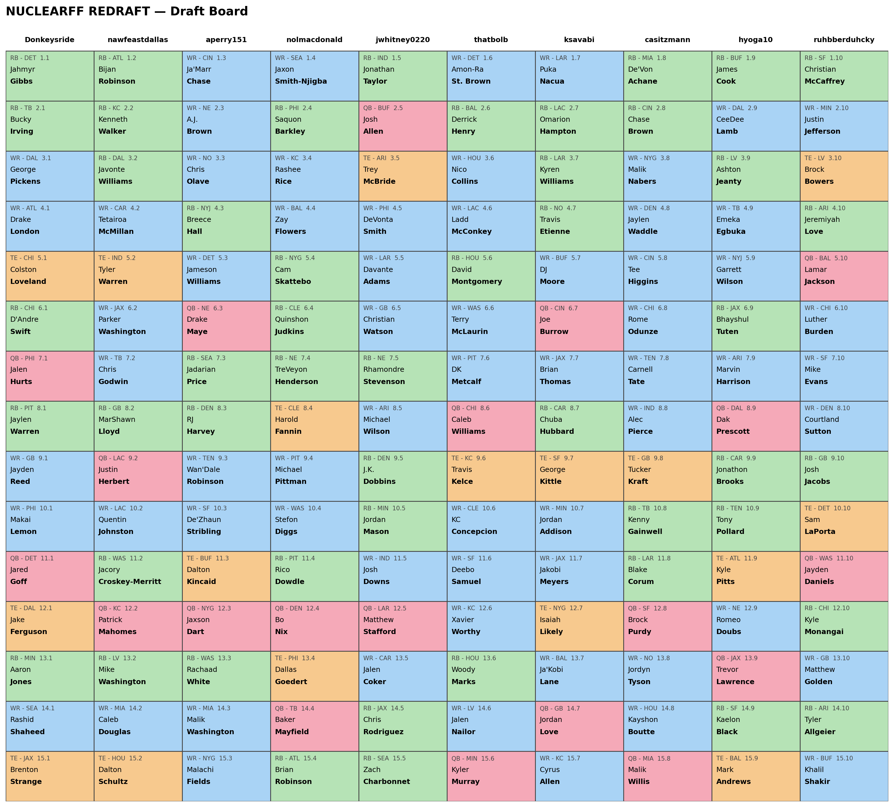
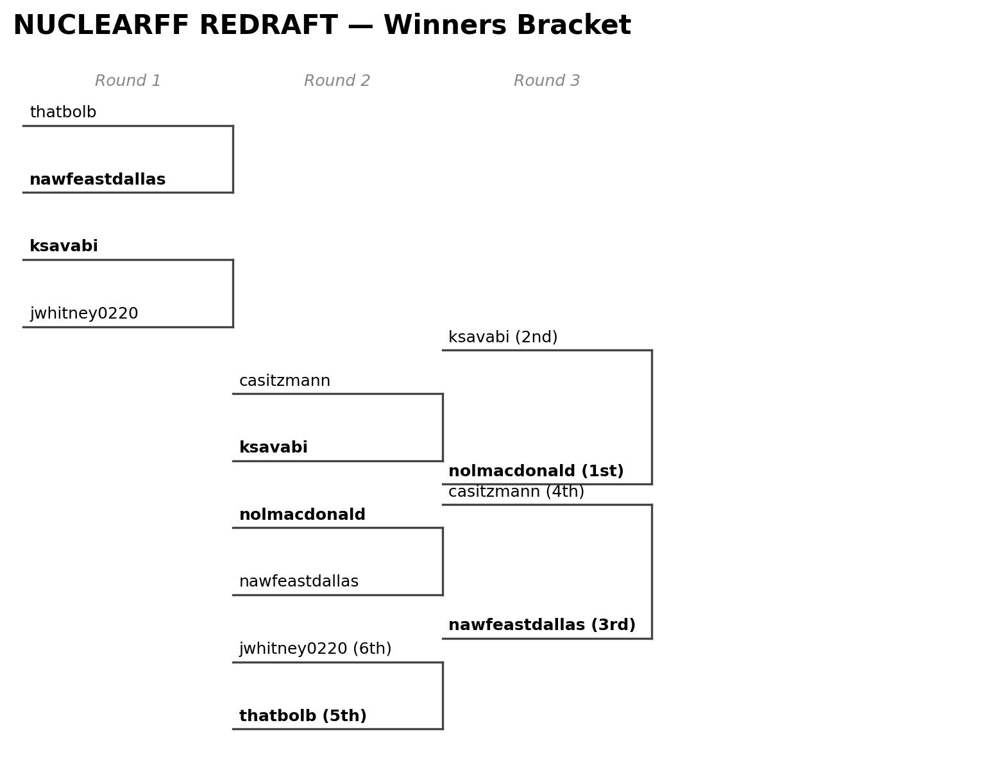
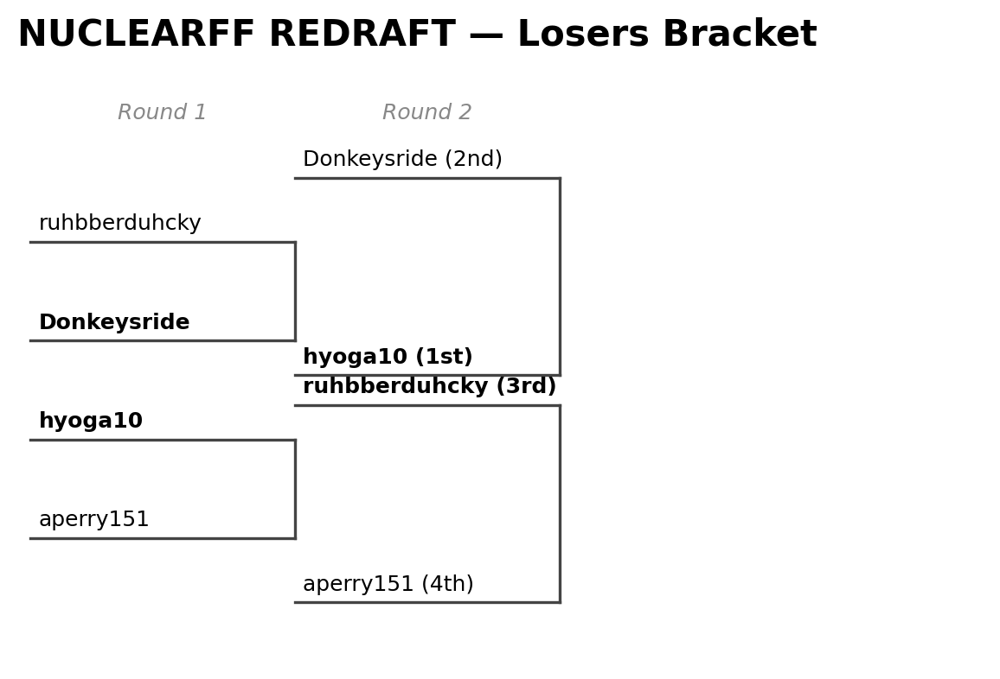

.. _tutorial_draft_and_playoff_visuals:

10. Draft and Playoff Visualizations
===========================================

:doc:`04_capturing_a_league` persisted draft picks, standings, and playoff
bracket matches. This chapter renders three views straight from that
stored data: a snake-order draft board grid, a playoff bracket tree, and a
manager's draft-order history table.

Draft board
---------------

:func:`~nuclearff.sleeper.draft.fetch_and_write_draft_picks` fetches (and
persists) one draft's picks; :func:`~nuclearff.report.draft_board.render_draft_board`
renders them as a snake-order grid of position-colored pick cards — one
column per draft slot (team), one row per round, matching Sleeper's own
draft-room UI:

.. code-block:: python

   import polars as pl
   from nuclearff.sleeper import SleeperClient, fetch_and_write_draft_picks
   from nuclearff.duckdb_io import read_table
   from nuclearff.report import render_draft_board

   league_id = "1367225133634191360"
   db_path = "./demo/data/cache/nuclearff.duckdb"

   with SleeperClient(cache_dir="./demo/data/cache") as client:
       drafts = client.get_league_drafts(league_id)
       draft_id = drafts[0]["draft_id"]
       pick_count = fetch_and_write_draft_picks(client, draft_id, db_path)
       draft = client.get_draft(draft_id)
       users = client.get_users(league_id)

   settings = draft["settings"]
   teams, rounds = settings["teams"], settings["rounds"]
   draft_order = draft.get("draft_order") or {}
   names_by_user = {u["user_id"]: u["display_name"] for u in users}
   names = {
       slot: names_by_user.get(uid) or f"Slot {slot}"
       for uid, slot in draft_order.items()
       if isinstance(slot, int)
   }

   picks = read_table(db_path, "sleeper_draft_picks").filter(
       pl.col("draft_id") == draft_id
   ).to_dicts()

   written = render_draft_board(
       picks, names, "./demo/data/artifacts/draft_board.png",
       teams=teams, rounds=rounds, title="NUCLEARFF REDRAFT — Draft Board",
   )
   print(f"Picks: {pick_count}")
   print(f"Draft board: {written}")

.. code-block:: text

   Picks: 150
   Draft board: demo/data/artifacts/draft_board.png

That's this league's real, complete 2026 draft: all 150 picks (10 columns,
15 rounds). Each cell shows the pick's position and NFL team, the pick
number (e.g. ``3.10`` — round 3, draft slot 10), and the player's name.
Cell color follows position: green for RB, blue for WR, pink for QB,
orange for TE — confirmed against Sleeper's own draft-room UI; any other
position falls back to a neutral gray.

   This league's real, complete 2026 draft (150 picks).

A draft's pick order isn't always a simple alternating snake — this
league's real draft has ``settings["reversal_round"] == 3``: round 3
continues round 2's column direction instead of reversing back to round
1's. The grid doesn't compute pick order itself; each pick's column is its
own real ``draft_slot``, which Sleeper has already resolved correctly,
reversal round included. Rendering an in-progress draft (not every round
complete yet) is the normal case, not an error — the grid simply draws
however many picks exist so far.

Playoff bracket
-------------------

:func:`~nuclearff.report.bracket.render_playoff_brackets` reads
``sleeper_playoff_matches`` and ``sleeper_standings``
(:doc:`04_capturing_a_league`'s ``fetch_and_write_standings``) and renders a
completed season's winners and losers brackets as horizontal tree PNGs:

.. code-block:: python

   import polars as pl
   from nuclearff.report import render_playoff_brackets

   season = 2025
   season_league_id = "1240509989819273216"  # this league's 2025 league_id

   matches = read_table(db_path, "sleeper_playoff_matches").filter(
       (pl.col("league_id") == season_league_id) & (pl.col("season") == season)
   ).to_dicts()
   standings = read_table(db_path, "sleeper_standings").filter(
       (pl.col("league_id") == season_league_id) & (pl.col("season") == season)
   )
   names = dict(zip(standings["roster_id"], standings["display_name"], strict=True))

   written = render_playoff_brackets(
       matches, names, "./demo/data/artifacts/brackets", league_name="NUCLEARFF REDRAFT"
   )
   for bracket, path in written.items():
       print(f"{bracket.title()} bracket: {path}")

.. code-block:: text

   Winners bracket: demo/data/artifacts/brackets/winners_bracket.png
   Losers bracket: demo/data/artifacts/brackets/losers_bracket.png

That's this league's real, completed 2025 season: 7 winners-bracket
matches and 4 losers-bracket matches, each rendered as its own figure
(Sleeper treats the two brackets as visually distinct, and so does this).
Each leaf/node is labeled with the real team display name; the winner of
each match renders bold; and a match carrying a placement (the
championship, the third-place game) appends the resulting rank, e.g.
``nolmacdonald (1st)``.

   Real winners bracket for this league's completed 2025 season.

   Real losers bracket for the same season.

A Sleeper bracket isn't a similarity-clustering dendrogram — it's a
fixed-shape single-elimination tree keyed by ``t1_from``/``t2_from`` match
references, so a later round's participant resolves through an earlier
match's *winner or loser* rather than a fresh pair of roster ids. This
league's own bracket has a real wrinkle: the championship and the
third-place game split from the exact same pair of semifinal matches,
landing on the same computed tree position — the renderer nudges the two
apart by their own box height so neither the lines nor the labels overlap.

Draft order history
-------------------------

:func:`~nuclearff.sleeper.draft.draft_order_stats` summarizes a manager's
draft-slot history across every season on file —average position, and how
often they landed first or last overall:

.. code-block:: python

   from nuclearff.sleeper import walk_league_chain, fetch_and_write_all_drafts, draft_order_stats
   from nuclearff.report import render_draft_order_table

   with SleeperClient(cache_dir="./demo/data/cache") as client:
       leagues = walk_league_chain(client, league_id, max_seasons=20)
       n = fetch_and_write_all_drafts(client, leagues, db_path)
   print(f"Draft picks: {n}")

   picks = read_table(db_path, "sleeper_draft_picks")
   standings = read_table(db_path, "sleeper_standings")
   stats = draft_order_stats(picks, standings)
   print(stats.sort("avg_draft_position").head(10))

.. code-block:: text

   Draft picks: 900
   shape: (10, 5)
   ┌────────────────┬─────────────────┬────────────────────┬──────────────────┬─────────────────┐
   │ manager        ┆ seasons_drafted ┆ avg_draft_position ┆ times_first_pick ┆ times_last_pick │
   ╞════════════════╪═════════════════╪════════════════════╪══════════════════╪═════════════════╡
   │ BigCookie96      ┆ 3               ┆ 2.0                ┆ 1                ┆ 0                │
   │ bigshett         ┆ 1               ┆ 3.0                ┆ 0                ┆ 0                │
   │ Donkeysride      ┆ 4               ┆ 3.25               ┆ 1                ┆ 0                │
   │ ruhbberduhcky    ┆ 4               ┆ 3.5                ┆ 2                ┆ 1                │
   │ macbuffet66      ┆ 2               ┆ 4.0                ┆ 0                ┆ 0                │
   │ nawfeastdallas   ┆ 4               ┆ 4.5                ┆ 1                ┆ 1                │
   │ aperry151        ┆ 6               ┆ 5.0                ┆ 1                ┆ 0                │
   │ thatbolb         ┆ 6               ┆ 5.833333           ┆ 0                ┆ 1                │
   │ nolmacdonald     ┆ 6               ┆ 6.166667           ┆ 0                ┆ 0                │
   │ hyoga10          ┆ 6               ┆ 6.5                ┆ 0                ┆ 0                │
   └────────────────┴─────────────────┴────────────────────┴──────────────────┴─────────────────┘

``render_draft_order_table`` turns this into the same styled PNG format as
the auction board's position tables (:doc:`09_auction_draft_board`). By
default (as with ``report trades``/``report wins`` in later chapters), only
managers currently rostered in the league's own season appear — pass
``--all-users``'s Python equivalent by *not* filtering ``standings`` to the
current ``league_id`` before calling ``draft_order_stats``, to include
every manager across the league's full history instead.

What's Next
-----------

Point-in-time projections and draft snapshots are half the picture.
:doc:`11_simulation` turns a single projected mean into a full range of
plausible season outcomes.
