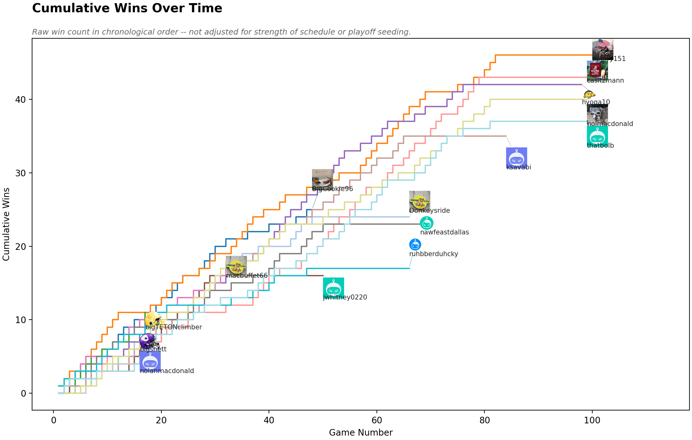
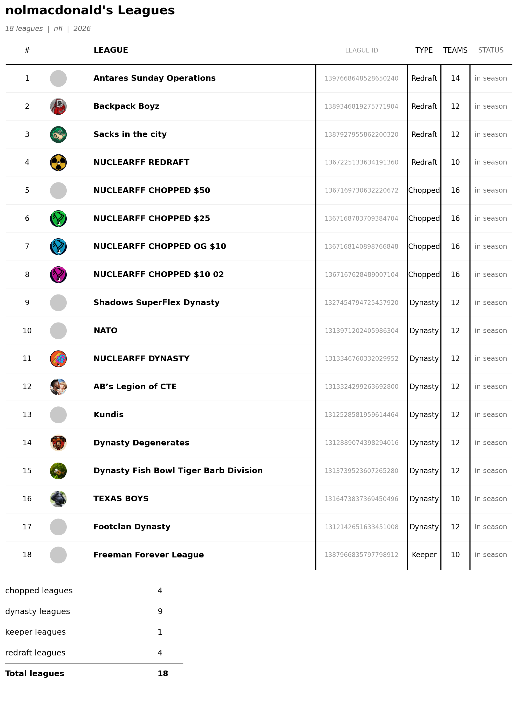

.. _tutorial_wins_and_leagues:

15. Cumulative Wins and League Overviews
===============================================

Two more views built from the data :doc:`04_capturing_a_league` and
:doc:`03_sleeper_api` already gave you: a manager's running win total over
their entire real career, and a full snapshot of every league a Sleeper
user belongs to.

Cumulative wins
--------------------

:func:`~nuclearff.sleeper.wins.weekly_results` derives each roster's
per-week win/loss/tie from raw matchup points (nothing stores this
directly), and :func:`~nuclearff.sleeper.wins.cumulative_wins` turns that
into a running total per manager, in each manager's own chronological
order:

.. code-block:: python

   from nuclearff.duckdb_io import read_table
   from nuclearff.sleeper.wins import weekly_results, cumulative_wins

   db_path = "./demo/data/cache/nuclearff.duckdb"
   matchups = read_table(db_path, "sleeper_matchups")
   standings = read_table(db_path, "sleeper_standings")

   results = weekly_results(matchups)
   cumulative = cumulative_wins(results, standings)
   print(cumulative.columns)
   print(f"{cumulative['manager'].n_unique()} managers")

.. code-block:: text

   ['manager', 'season', 'week', 'game_number', 'cumulative_wins']
   15 managers

:func:`~nuclearff.report.wins.render_cumulative_wins` renders this as a
step chart, one line per manager, ending in that manager's real Sleeper
headshot rather than a text label. It needs each manager's avatar id —
pull it straight from ``get_users``:

.. code-block:: python

   from nuclearff.sleeper import SleeperClient
   from nuclearff.report import render_cumulative_wins

   league_id = "1367225133634191360"
   with SleeperClient(cache_dir="./demo/data/cache") as client:
       users = client.get_users(league_id)
   avatar_ids = {u["display_name"]: u.get("avatar") for u in users}

   written = render_cumulative_wins(
       cumulative, avatar_ids, "./demo/data/artifacts/wins.png",
       cache_dir="./demo/data/cache/avatars",
   )
   print(written)

   Real output for this league's real 15 managers across its full
   6-season history.

A manager's line starts at game 1 of *their own* real history, not the
league's — a manager who joined partway through doesn't get their earlier
seasons backfilled. This is raw chronological win count, not adjusted for
strength of schedule or playoff seeding — recall from :doc:`04_capturing_a_league`
why that distinction matters here specifically: this league's real 2025
regular-season leader went 20-8 but finished 4th place, while the eventual
champion was 16-12. A manager missing from ``avatar_ids`` (or mapped to a
failed download) renders with a neutral placeholder image rather than a
broken one.

A user's leagues, as a PNG table
--------------------------------------

:func:`~nuclearff.report.user_leagues.render_user_leagues_table` resolves
a username to every league they're in for a season and renders it as a
PNG table — avatar, name, league id, type, team count, status:

.. code-block:: python

   from nuclearff.report import render_user_leagues_table, summarize_league_types

   with SleeperClient(cache_dir="./demo/data/cache") as client:
       user = client.get_user("nolmacdonald")
       leagues = client.get_user_leagues(user["user_id"], 2026, sport="nfl")

   written = render_user_leagues_table(
       leagues, "./demo/data/artifacts/user_leagues.png",
       title=f"{user['display_name']}'s Leagues",
       subtitle=f"{len(leagues)} leagues  |  nfl  |  2026",
       cache_dir="./demo/data/cache/avatars",
   )
   print(f"User:    {user['display_name']} ({user['user_id']})")
   print(f"Leagues: {written}")

.. code-block:: text

   User:    nolmacdonald (332632476830679040)
   Leagues: demo/data/artifacts/user_leagues.png

   Real output for ``nolmacdonald``'s real 18 leagues for the 2026
   season.

:func:`~nuclearff.report.user_leagues.summarize_league_types` gives the
same per-type breakdown the table's own bottom row shows, as a plain dict:

.. code-block:: python

   print(summarize_league_types(leagues))

.. code-block:: python

   {'chopped': 4, 'dynasty': 9, 'keeper': 1, 'redraft': 4, 'Total': 18}

``Type`` resolves Sleeper's numeric ``settings.type`` (0/1/2/3) to a
readable label from the league object itself, not a name-substring match
— a league can be genuinely Chopped-type without yet having eliminated
anyone this season. A league with no avatar set (real for several of this
account's real leagues) gets a neutral placeholder image, not a broken
cell.

Actual vs. projected performance
---------------------------------------

One more comparison worth knowing about: :mod:`nuclearff.sleeper.performance`
turns Sleeper's own weekly player projections (fetched with
:func:`~nuclearff.sleeper.projections.fetch_and_write_projections_range`,
scored under this league's rules) against real results, ranking who most
over- or under-performed expectation:

.. code-block:: python

   from nuclearff.sleeper.projections import fetch_and_write_projections_range
   from nuclearff.sleeper.performance import weekly_actuals, weekly_performance
   from nuclearff.ids import read_sleeper_players

   with SleeperClient(cache_dir="./demo/data/cache") as client:
       fetch_and_write_projections_range(client, 2026, [1], db_path)

   projections = read_table(db_path, "sleeper_projections")
   players = read_sleeper_players(db_path)

   actuals = weekly_actuals(matchups, standings, league_id, 1)
   perf = weekly_performance(actuals, projections, players, league_cfg.scoring)
   print(
       perf.sort("delta", descending=True)
       .select(["player_name", "position", "manager", "actual_points", "projected_points", "delta"])
       .head(3)
   )

.. code-block:: text

   shape: (3, 6)
   ┌─────────────────┬──────────┬──────────────┬───────────────┬───────────────────┬────────┐
   │ player_name      ┆ position ┆ manager      ┆ actual_points ┆ projected_points  ┆ delta  │
   ╞══════════════════╪══════════╪══════════════╪═══════════════╪═══════════════════╪════════╡
   │ Jalen Coker       ┆ WR       ┆ jwhitney0220 ┆ 33.8          ┆ 11.88             ┆ 21.92  │
   │ Caleb Williams    ┆ QB       ┆ thatbolb     ┆ 41.26         ┆ 20.65             ┆ 20.62  │
   │ Kenneth Walker     ┆ RB      ┆ nawfeastdallas ┆ 34.1        ┆ 13.63             ┆ 20.47  │
   └─────────────────┴──────────┴──────────────┴───────────────┴───────────────────┴────────┘

``starters_only=True`` (the default) excludes bench players. Pass a whole
season's worth of weeks through
:func:`~nuclearff.sleeper.performance.season_actuals` and
:func:`~nuclearff.sleeper.performance.season_summary` (which gates on
``min_games`` so one huge single-week delta can't dominate a season
ranking) for the same comparison averaged across a season instead of one
week. :func:`~nuclearff.report.performance.render_weekly_performance_table`
and :func:`~nuclearff.report.performance.render_season_performance_table`
render either as a styled PNG table.

What's Next
-----------

This closes out the feature tour. :doc:`16_draft_companion_tools` covers
two smaller, newer library functions still under active development, and
:doc:`17_querying_and_provenance` ties everything in this tutorial back
together — one shared database, and how to record exactly how a dataset
was built.
